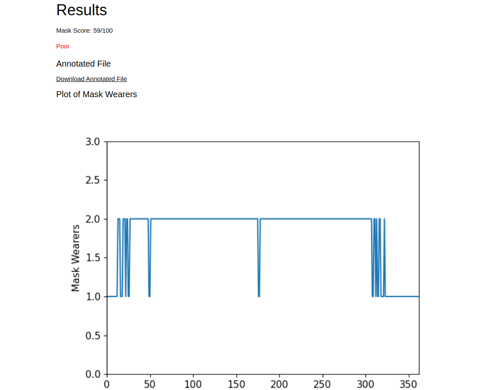

# Mask Detection Monitor


## Demo

This project has been integrated into a web application found [here](https://www.zeyadmansour.com/sdm/).


## Prerequisites

* You have installed a 64-bit release of [Python](https://www.python.org/downloads/) 3.7 or above

## Installing SDM

1. Clone this repository.

2. Navigate to the root of the project folder via the CLI. Use the package manager [pip](https://pip.pypa.io/en/stable/) to install the necessary dependencies.
```
pip3 install -r requirements.txt
```  

## Using SDM

Navigate to the root of the project folder via the CLI. Make sure to specify the SOURCE.
* Image or video: SOURCE is the path to that file (relative to the root folder)
	* This is the purpose of the [input_data](input_data) folder.
* Webcam: Provide no additional arguments
* HTTP/RTSP stream: SOURCE is the URL

```
python sdm.py "SOURCE"
```
(Ensure that the default interpreter for the "python" command is version 3.7 or above)
## Contributors

This project was created in contribution with:

* [@0xmmalik](https://github.com/0xmmalik) 📖

## Notes

This project was created as part of [OSU's 2021 HS hackathon](https://hack.osu.edu/hs/2021/) and won 1st place.

## License

This project uses the following license: [MIT](https://github.com/zeyad-mansour/social-distancing-monitor/blob/main/LICENSE)
