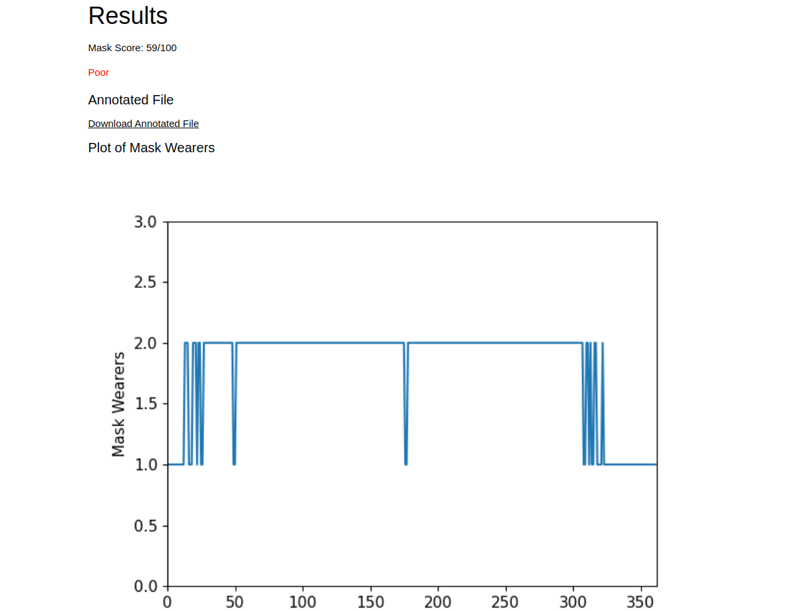

# Mask Detection Monitor


The [YOLOv5](https://github.com/ultralytics/yolov5) framework yields extremely fast inference times with high accuracy.

## Demo

This project has been integrated into a web application found [here](https://www.zeyadmansour.com/sdm/).

Example Image Output:


Example Video Output:


## Prerequisites

* You have installed a 64-bit release of [Python](https://www.python.org/downloads/) 3.7 or above
* All Python modules required are installed (see "Installing SDM" below)

## Installing SDM

1. Clone this repository.

2. Navigate to the root of the project folder via the CLI. Use the package manager [pip](https://pip.pypa.io/en/stable/) to install the necessary dependencies. e.g.,
```
pip install -r requirements.txt
```  

## Using SDM

Option 1: Navigate to the root of the project folder via the CLI. e.g.,
```
python sdm.py [source]
```
* Image or video: [source] is the path to that file (relative to the root folder)
* Webcam: Do not enter [source]
* HTTP/RTSP stream: [source] is the URL

_Ensure that the default interpreter for the `python` command is version 3.7 or above (or use `python3`)_

Option 2: Upload images/videos to the [web application](https://www.zeyadmansour.com/sdm/).
## Contributors

This project was created by:

* Zeyad Mansour ([@zeyad-mansour](https://github.com/zeyad-mansour/))
* Manav Malik ([@0xmmalik](https://github.com/0xmmalik/))

## Notes

This project was created as part of [OSU's 2021 HS hackathon](https://hack.osu.edu/hs/2021/) and won 1st place.

## License

This project uses the following license: [MIT](https://github.com/zeyad-mansour/mask-detection-monitor/blob/main/LICENSE)
